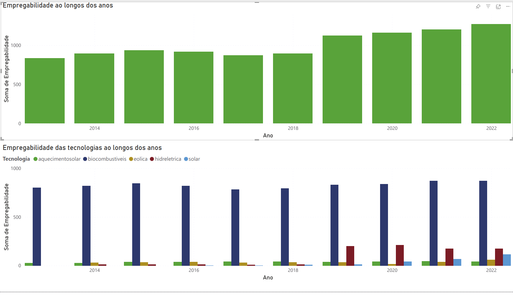

# DashBoard

## Introdução
Neste documento, apresentaremos as Dashboards criadas com a utilização das nossas [fontes de dados](https://residenciaticbrisa.github.io/04_PipelineTCU/fonte_dados/fonte_dados/).

## **1. Empregabilidade ao longos dos anos e Empregabilidade das tecnologias ao longos dos anos**

Realizado com Dados do [Renewable Energy and Jobs](https://residenciaticbrisa.github.io/04_PipelineTCU/fonte_dados/fonte_dados/) de 2022 à 2013 

 <figcaption>Figura 1: Apresentação da Dash de Empregabilidade  </figcaption> 

    

 