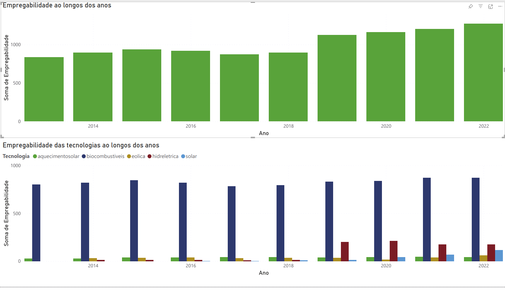
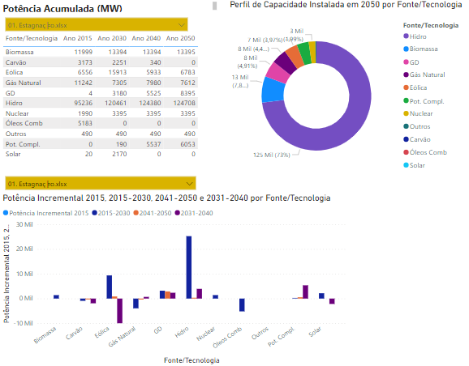
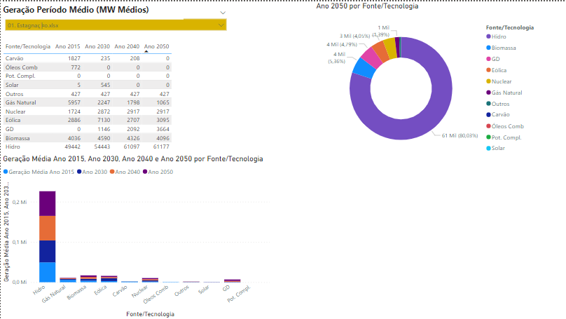
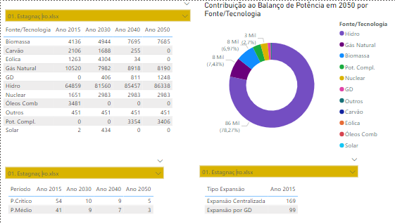

# DashBoard

## Introdução
Neste documento, apresentaremos as Dashboards criadas com a utilização das nossas [fontes de dados](https://residenciaticbrisa.github.io/04_PipelineTCU/fonte_dados/fonte_dados/).

## **1. Empregabilidade ao longos dos anos e Empregabilidade das tecnologias ao longos dos anos**

Realizado com Dados do [Renewable Energy and Jobs](https://residenciaticbrisa.github.io/04_PipelineTCU/fonte_dados/fonte_dados/) de 2022 à 2013 

 <figcaption>Figura 1: Apresentação da Dash de Empregabilidade  </figcaption> 

    

 

## **2. Potência Acumulada Por Cenário do Plano Nacional de Energia 2050**

Realizado com Dados do [Plano Nacional de Energia 2050](https://residenciaticbrisa.github.io/04_PipelineTCU/fonte_dados/fonte_dados/) de 2050 à 2015. 

 <figcaption>Figura 2: Potência Acumulada (MW) por Cenário</figcaption> 

    

 

## **3. Geração Período Médio Por Cenário do Plano Nacional de Energia 2050**

Realizado com Dados do [Plano Nacional de Energia 2050](https://residenciaticbrisa.github.io/04_PipelineTCU/fonte_dados/fonte_dados/) de 2050 à 2015. 

 <figcaption>Figura 3: Geração Período Médio (MW Médios)</figcaption> 

    

 

## **4. Balanço de Potência Por Cenário do Plano Nacional de Energia 2050**

Realizado com Dados do [Plano Nacional de Energia 2050](https://residenciaticbrisa.github.io/04_PipelineTCU/fonte_dados/fonte_dados/) de 2050 à 2015. 

 <figcaption>Figura 4: Balanço de Potência (MW)</figcaption> 

    

 

## **5. Balanço de Potência Por Cenário do Plano Nacional de Energia 2050**

Realizado com Dados do [Sistema de Informações Energéticas - Ministério de Minas e Energia](https://residenciaticbrisa.github.io/04_PipelineTCU/fonte_dados/fonte_dados/).

 <figcaption>Figura 5: Painel TCU</figcaption> 

    

 