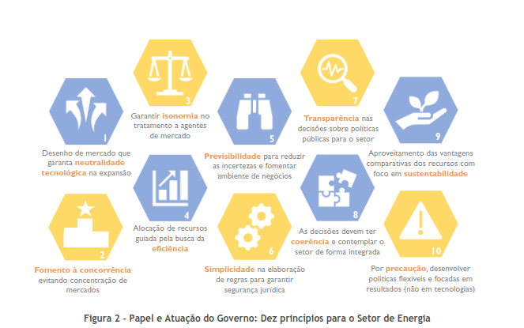
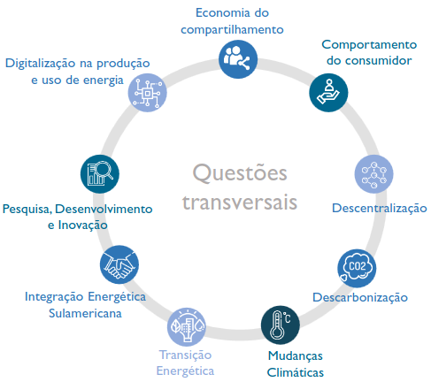
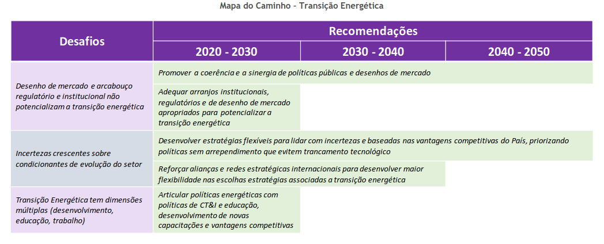

# **Plano Nacional de Energia 2050**

## ​Definição

Primeiramente, o plano nacional de energia 2050 é um instrumento de suporte ao desenho da estratégia de longo prazo do planejador em relação à expansão do setor energético do Brasil. Ele é desenvolvido pela EPE de acordo com as diretrizes do Ministério de Minas e Energia

"Ao lançar o PNE, o Governo Federal enuncia os termos de uma estratégia de longo prazo para o setor energético, e com isso chama à construção de grandes consensos com a sociedade e as empresas, em prol do desenvolvimento do País."

## ​Introdução

Associadas a tais mudanças, foram elaborados dois grandes cenários, formando um cone de incertezas para o desenho da estratégia de longo prazo: o primeiro, chamado de **Desafio da Expansão** , que reflete requisitos de expansão do setor de energia para atendimento a um crescimento da demanda de energia mais expressivo. No segundo, chamado de **Estagnação** , analisam as consequências de um cenário em que o consumo de energia per capita mantêm-se inalterado ao longo de todo o período. Neste caso, a questão da expansão da produção é menos premente, embora ainda reste a necessidade de se desenhar a politica energética mais adequada para atender ao crescimento vegetativo da demanda.

O foco do relatório está voltado para o cenário Desafio da Expansão, uma vez que tal contexto impõe ao planejador, além da necessidade de reforçar e aperfeiçoar os mecanismos e as políticas vigentes, também buscar soluções inovadoras que permitam o estabelecimento de uma estratégia de expansão de longo prazo do setor energético de forma a garantir o fornecimento de energia à sociedade nesse horizonte, atendendo critérios de segurança energética, retorno adequado aos investimentos, disponibilidade de acesso à população e socioambientais.

O cenário de Estagnação, embora tenha seus desafios intrínsecos relativos a um ambiente econômico e de desenvolvimento mais adverso, não constitui, do ponto de vista do planejador do setor de energia, uma preocupação iminente em termos de expansão da capacidade de atendimento da demanda de energia, visto o aumento da oferta de energia verificado nos últimos anos. Assim, sua atenção poderia estar mais concentrada, por exemplo, em discussões sobre o perfil mais adequado da matriz energética nacional, de acordo com algum critério de interesse ( ex. emissões de gases de efeito estufa)

**1. Estrutura do relatório do PNE 2050**

Uma parte importante também do relatório é a sua estrutura, que conforme disposto no inciso 1 do capítulo de introdução, é constituída de duas partes:

- Na primeira parte são apresentados os principais fatores que condicionam (e, em vários casos são condicionados por) a evolução do setor de energia e que foram, portanto, denominadas questões transversais. Vale ressaltar também que são descritos os resultados finais do exercício de análise a longo prazo e os principais direcionamentos para o desenho da estratégia de longo prazo.
- Na segunda parte, a análise é organizada por tipo de tecnologia, infraestrutura de transporte de energia e por segmentos de consumo.

Na introdução do PNE 2050, é exibida uma tabela que contem o tipo de fatores condicionantes ( ou condicionados), suas palavras-chaves e uma breve sinopse. Fatores estes que são utilizados para o estudo de cenários que o PNE 2050 avalia.

**2. Contexto do PNE 2050**

Nesta parte do capítulo de introdução, é feita uma comparação entre o PNE 2050 e o PNE 2030. Nessa comparação podemos perceber o que motivou a criação de uma nova estratégia, trata-se de dois fatores que se fortalecerem com o início do século XXI: a busca por maior eficiência energética e o respeito a questões socioambientais. O capítulo também trata de questões que o PNE 2030 ajudou a contribuir e serviu como diretriz.

"Três diferenças podem ser elencadas em relação ao PNE 2030: a abordagem do problema, o reconhecimento da imprevisibilidade inerente do futuro e a perspectiva de abundância de recursos no horizonte de longo prazo."

"Assim, mais fundamental do que a discussão de quantos cenários serão avaliados e qual a matriz energética resultante em 2050 em cada um deles é estabelecer as orientações de longo prazo que permitam a todos os agentes do setor tomar suas decisões de modo a alcançar o melhor resultado para o desenvolvimento do setor de energia".

Existem questões que o PNE 2050 tenta se pautar durante sua elaboração, estas questões são limitadas por dois cenários:

- cenário Desafio da Expansão, definido como aquele em que as autoridades do setor de energia precisam lidar com uma expansão significativa da demanda de energia ao desenhar sua estratégia para o setor.
- O cenário de Estagnação, em que a questão da expansão não é tão relevante, mas ainda assim há um espaço para avaliar a evolução da matriz de energia.

**3. Papel e Atuação do Governo: Princípios para o Setor de Energia**

## ​Produção e Uso de Energia

Nesta seção, são apresentados as principais considerações no tratamento do panorama em relação a produção e ao uso de energia no horizonte de 2050.

Destaca-se nesta seção que o Brasil, em um futuro não tão remoto, deve se tornar, de um demandante líquido de energia para um ofertante líquido de energia, visto que o país atualmente produz mais do que demanda de energia. O grande desafio aparece quando se vislumbra um cenário de transição energética mundial, onde as incógnitas ficam para os pontos de tecnologia e fontes que suprirão estas novas demandas. Mas, é certo que o Brasil, devido a sua grande riqueza natural e de recursos, suprirá sua demanda energética atual e futura no horizonte de 2050.

**Administração da abundância (1):** a disponibilidade total de recursos supera largamente a demanda de energia total no horizonte até 2050.

Tendo em vista essa abundância, um dos pontos que o PNE 2050 aborda é a administração desta abundância energética. "Seguramente, tal tarefa leva em conta as implicações econômicas que surgirão de o País se tornar grande produtor de energia, com grande riqueza de fontes distintas de energia".

**Administração da abundância (2):** só a parcela dos recursos mais facilmente acessíveis excede em 60% a demanda de energia total acumulada do período. " […] Caso não haja economicidade, o poder público pode avaliar a criação e a implementação de políticas no sentido de aproveitamento de determinadas fontes. Logo, a facilidade de aproveitamento dos recursos torna-se tão relevante quanto o seu potencial."

**Administração da abundância (3):** o aproveitamento de boa parte dos recursos implicará desafios significativos.

## ​Questões Transversais

O texto discute os fatores que devem ser considerados no planejamento energético de longo prazo em meio a grandes transformações. Estas mudanças estão relacionadas à chamada transição energética, caracterizada pela descarbonização das matrizes energéticas para combater as mudanças climáticas, descentralização dos recursos energéticos e maior digitalização na produção e uso de energia. Além disso, o papel do consumidor também está mudando devido aos avanços tecnológicos e novos modelos de negócios.

Esses fatores foram agrupados como questões transversais que influenciam a expansão da produção e uso de energia no Brasil. O texto aborda cada questão transversal, suas relações com as políticas energéticas vigentes e os principais desafios que podem afetar a estratégia de atuação no longo prazo do tomador de decisão no setor de energia. As recomendações sugeridas são apresentadas para cada questão, divididas ao longo das próximas décadas para atingir a maturidade na execução do plano de ação.

***Neste Relatório de Resumo só será abordado a área de interesse do TCU, ou seja o setor de transição energética.***

### ​ Transição Energética

O texto aborda a temática da Transição Energética e suas implicações no contexto mundial. A transição energética envolve mudanças na matriz energética global, direcionando para uma economia de baixo carbono e maior eficiência energética. Isso implica na substituição gradual de fontes intensivas em emissão de carbono por fontes renováveis, eletrificação dos processos de conversão de energia e maior automação e digitalização. Além disso, a transição energética também impacta tecnologias, padrões de consumo, relações socioeconômicas e a geopolítica da energia.

O processo de transição envolve diversas dimensões e é complexo, podendo levar um longo tempo para se concretizar. As principais fontes que desempenharão um papel relevante nesse processo são a eletrificação (com destaque para as energias renováveis), os biocombustíveis, a eficiência energética catalisada pela digitalização e o gás natural( como combustível de transição).

Além disso, o hidrogênio é considerado uma alternativa relevante para atender setores de consumo que têm dificuldade em serem atendidos por eletricidade ou biocombustíveis, sendo que a rota verde de produção (eletrólise da água com fontes renováveis de eletricidade) é vista como a mais relevante internacionalmente para produção de hidrogênio dentro de outras alternativas.

Para cumprir os objetivos do Acordo de Paris e descarbonizar o sistema energético mundial, é necessário investir cada vez mais em fontes renováveis e integrá-las aos setores que demandam energia. Porém, é importante garantir a competição entre diferentes soluções que atendam às necessidades do sistema, incluindo o gerenciamento da variabilidade das fontes renováveis.

#### Políticas em vigor para o Setor de Energia:

Não há políticas específicas para transição energética no Brasil, mas há uma série de políticas que afetam e favorecem a transição energética, são elas: Política Nacional sobre Mudança do Clima – PNMC, Lei 12.187 de 2009; Contribuição Nacionalmente Determinada – NDC; Política Nacional de Biocombustíveis – RenovaBio, Lei nº 13.576, de 26 de dezembro de 2017; Novo Mercado de Gás, Decreto nº 9.616/2018 (que altera o Decreto nº 7.382/2010), Resolução CNPE nº16/2019, Termo de Compromisso de Cessação – TCC Petrobras-CADE, Ajuste SINIEF/CONFAZ nº 03/2018, Decreto nº 9.934/2019; Modernização do Setor Elétrico, Consulta Pública nº 33/2017 , Portaria nº 187/2019, PLS 232/2016 e PL 1.917/2015.

Existem também outras políticas, programas, iniciativas e ações que se relacionam indiretamente ao tema da transição energética.

#### Desafios para o Tomador de Decisão no Setor de Energia

O texto aborda os desafios que o tomador de decisão no setor de energia enfrenta durante a transição energética. Os principais pontos são:

1. Desenho de mercado e arcabouço regulatório: As barreiras não econômicas, como falta de informação, aversão ao risco tecnológico e normas associadas ao paradigma tecnológico anterior, dificultam a potencialização da transição energética.
2. Incertezas sobre a evolução do setor: A inovação em curso, incluindo eletrificação, automação, conectividade e descarbonização, traz desafios econômicos e competitivos. É fundamental monitorar as incertezas tecnológicas, econômicas e ambientais para evitar trajetórias rígidas que possam implicar em riscos futuros.
3. Multiplicidade de dimensões da transição: A transição energética oferece oportunidades de negócios associadas às vantagens competitivas do Brasil, mas também requer alinhamento estratégico para criar um ambiente de negócios atrativo e inovador. Desenvolver a capacitação em tecnologias como digitalização, automação e segurança cibernética é essencial. Além disso, coordenar políticas setoriais de energia com outras esferas, como econômica, científico-tecnológica e ambiental, é um desafio importante.

#### Recomendações para o Tomador de Decisão no Setor de Energia

As recomendações para o tomador de decisão no setor de energia se dividem em duas categorias: aquelas que reforçam as vantagens competitivas do Brasil e as que desenvolvem novas vantagens e gerenciam as incertezas da transição energética.

1. _Promover a sinergia de políticas públicas e desenhos de mercado associados_: É importante garantir que as políticas públicas e desenhos de mercado sejam coerentes e sinérgicos entre si. Devem ser incentivadas políticas que promovam a eficiência energética, o uso de biocombustíveis, a eletrificação de frotas e transportes não motorizados, além de investimentos em tecnologias de hidrogênio. Além disso, é necessário alinhar as políticas energéticas com as políticas ambientais e compromissos internacionais relacionados às mudanças climáticas e desenvolvimento sustentável.
2. _Adequar arranjos institucionais, regulatórios e de desenho de mercado apropriados para potencializar a transição energética_: A transição energética requer aprimoramentos nos arranjos institucionais e regulatórios para internalizar as externalidades ambientais nos preços de energia e tornar o mercado mais aberto, competitivo e ágil. As distribuidoras de energia têm um papel central nesse processo, especialmente por meio de iniciativas de digitalização e remuneração adequada aos serviços prestados. O fomento à inovação tecnológica e o desenvolvimento de nichos de inovação também são fundamentais.
3. _Desenvolver estratégias flexíveis para lidar com incertezas e baseadas nas vantagens competitivas do País, priorizando políticas sem arrependimento que evitem trancamento tecnológico_: O Brasil deve aproveitar suas vantagens competitivas na transição energética e usar isso como base para desenvolver ou migrar competências. Priorizar políticas sem arrependimento, ou seja, políticas que trazem benefícios independentemente do caminho tecnológico escolhido, é essencial para evitar riscos e trancamento tecnológico. Em vez de definir uma rota tecnológica específica, é mais adequado estabelecer políticas que promovam resultados e competição entre diferentes rotas tecnológicas, permitindo a inovação e a superação de tecnologias específicas.
4. _Reforçar alianças e redes estratégicas internacionais para desenvolver maior flexibilidade nas escolhas estratégicas associadas a transição energética_: O Brasil possui relações diplomáticas e econômicas amplas com diversos países, o que lhe confere margem para estabelecer parcerias e projetos em diferentes áreas e com países distintos. Essas alianças e redes estratégicas fortalecem o país em termos geopolíticos e proporcionam maior flexibilidade nas escolhas estratégicas relacionadas à transição energética, gerando diversidade de caminhos e graus de liberdade nas decisões. Essa pluralidade de ações é um ativo relevante para o processo de transição energética
5. _Articular as políticas energéticas com políticas de CT&I e educação, desenvolvimento de novas capacitações e vantagens competitivas:_ É importante reforçar a ligação entre o planejamento energético nacional e o sistema nacional de inovação, políticas de ciência, tecnologia e inovação (CT&I) e educação. Isso permitirá criar um ambiente de negócios propício à inovação em mercados abertos e competitivos, possibilitando que as instituições de CT&I coloquem suas inovações no mercado e as disseminem de forma mais ampla.

## **Conclusão**

O Plano Nacional de Energia 2050 é um importante instrumento de suporte para a estratégia de longo prazo do setor energético brasileiro. Elaborado pela EPE e seguindo as diretrizes do Ministério de Minas e Energia, o plano busca construir consensos com a sociedade e as empresas em prol do desenvolvimento do país.

O relatório abordou dois grandes cenários: o Desafio da Expansão e a Estagnação. Dado o contexto de transição energética mundial, o foco concentrou-se no Desafio da Expansão, que demanda aprimoramentos nas políticas e mecanismos vigentes e busca de soluções inovadoras para garantir o fornecimento de energia à sociedade de forma segura e sustentável.

A transição energética é um tema central no relatório, envolvendo a substituição gradual de fontes intensivas em emissão de carbono por renováveis, a eletrificação, a eficiência energética e o uso de gás natural como combustível de transição. O Brasil, com sua abundância de recursos naturais, tem o potencial de se tornar um ofertante líquido de energia, o que implica em administrar essa abundância de forma econômica e sustentável.

O tomador de decisão no setor de energia enfrenta diversos desafios, como o desenho de mercado e arcabouço regulatório adequados, a gestão das incertezas sobre o futuro do setor e a coordenação entre diferentes políticas setoriais. Para superar esses desafios, o relatório apresenta recomendações que enfatizam a sinergia entre políticas públicas, o desenvolvimento de estratégias flexíveis baseadas nas vantagens competitivas do país, a busca por políticas sem arrependimento e a criação de alianças internacionais estratégicas.

Por fim, é fundamental articular as políticas energéticas com as de ciência, tecnologia e inovação, bem como investir em novas capacitações e vantagens competitivas. Dessa forma, o Brasil poderá enfrentar os desafios da transição energética com sucesso, promovendo um futuro sustentável e próspero para o setor energético do país.