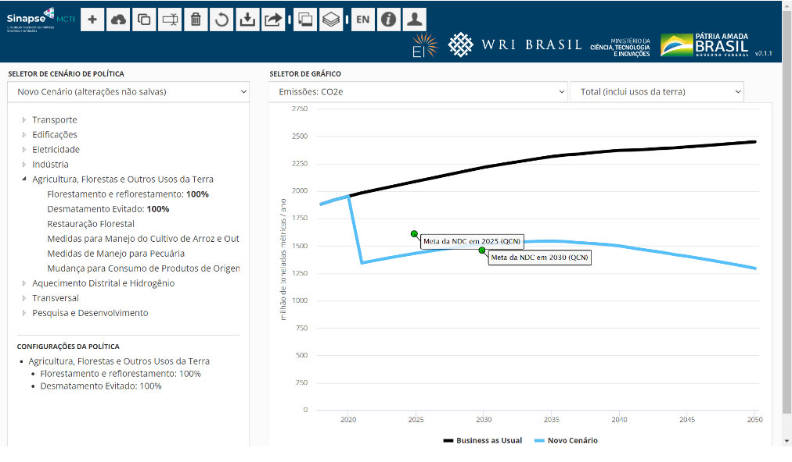

# Projetos Similares

Nesta análise, apresentaremos uma compilação de projetos semelhantes ao nosso, buscando inspiração e aprimoramento das funcionalides. Através desta análise, exploraremos diferentes abordagens e soluções adotadas por outros projetos para enfrentar problemas semelhantes aos nossos.

# WRI - SINAPSE
É um sistema capaz de simular os efeitos de emissão de gases de efeito estufa (GEE) diretos e indiretos conforme as políticas setoriais.
Ou seja, o usuário insere um cenário e pode combinar com outros e ter uma simulação dos resultados. Por exemplo: se as exigências nos padrões de emissões dos veículos fossem maiores ou se o desmatamento ilegal chegasse a zero, quanto seria a redução de emissões do Brasil em 2050? 

## LIMITAÇÕES
- A incerteza de resultados cresce
proporcionalmente ao conjunto de políticas
inseridas nos cenários. Os dados de entrada
na ferramenta devem ser estudados, medidos
ou simulados sob determinado conjunto de
hipóteses.

- O modelo não avalia adicionalidades de
medidas. O usuário pode, livremente, testar o
impacto da inserção dos 50 instrumentos de políticas
públicas disponíveis na ferramenta, embora muitas
não sejam adicionais.

- Caracterizar o nível de incerteza,
numericamente, não é possível.
Limites de incerteza não foram associados aos dados
de entrada. Portanto, não é possível estimar o
grau de incerteza relativo aos dados de saída
(resultados). Como alternativa, o modelo oferece
suporte à análise de Monte Carlo, que pode medir a
sensibilidade dos resultados a alterações nos dados
de entrada

- A ferramenta simula o impacto e não as 
metas de políticas públicas. O EPS Brasil é 
um modelo que permite a simulação de cenários 
futuros, ou seja, de construção de trajetórias 
possíveis. Contudo, esses cenários factíveis estão 
sob a influência do operador da ferramenta do EPS 
Brasil, o qual faz a inserção e estabelece o nível 
de adoção de políticas.

- São limitadas as opções de políticas para 
o setor agrícola, florestas e outros usos 
da terra. Na versão adaptada para o Brasil 
não foi possível adicionar, sobretudo, políticas 
da agricultura de baixo carbono. 

- Diversas técnicas são usadas para evitar 
dupla contagem de impacto de políticas, e 
essas técnicas envolvem trade-offs. Políticas 
que alteram preços, como é o caso da taxação de 
carbono, alteram a demanda por bens ou serviços e 
as decisões dos compradores que procuram novos 
equipamentos.

## FUTUROS DESENVOLVIMENTOS
No momento, a ferramenta contempla somente dois 
cenários: BAU e políticas de P&D sem arrependimento.

- pode ser aprimorada a fim de permitir variações quanto ao 
grau de implementação dessas políticas, em especial 
no nível de desmatamento

- Ademais, pode apresentar impactos adicionais decorrentes de políticas, tais como 
a geração de emprego e renda associada à mitigação de 
emissões de GEE.

-  Ainda, o modelo poderá ter o ano-base atualizado com vistas a produzir informações que 
sejam recorrentemente utilizadas para a proposição de 
políticas climáticas e de desenvolvimento sustentável. 

- podem ser adicionadas políticas de 
incentivo à agricultura de baixo carbono

- No setor florestal, podem ser consideradas políticas de 
incentivo ao plantio de florestas comerciais, assim como 
plantio misto de espécies exóticas e nativas

- ao nível do setor de transportes, podem ser 
considerados mandatos de vendas de veículos híbridos 
flex, levando em conta a vocação do país na produção 
de etanol

- E, no caso do setor energético, incentivos à 
produção de biocombustíveis de segunda geração, que 
futuramente deverão encontrar nichos de consumo nos 
transportes aéreo e marítimo, tendo em vista metas de 
redução de emissões que terão que cumprir.

## Fontes de dados úteis
Podem ser afetados por limitações dos dados disponíveis. Mas existem algumas fontes que podemos usar no nosso projeto.
OBS: Os dados abaixo contém apenas uma amostra dos dados totais disponíveis.

| DESCRIÇÃO  | Valores específicos para o Brasil?     | Fonte de dados |
| ---------- | ---------------------------------------| -------------- |
| Custo social do carbono | Não | US Gov.  |
| Custo da geração solar distribuída  | Não | NREL; EnerNex, 2015 |
| Eficiência de conversão elétrica por combustível | Sim | Koberle et al., 2018 |
| Importação e exportação de eletricidade | Sim | EPE; ONS |
| Custo de substituição de combustível como fração do custo de construção | Não | Herald News; ENN |
| Uso de água por tipo de planta | Não | PNNL |
| Capacidade da bateria por tipo de veículo | Não | Irena; Lindon, 2016; Lambert, 2016 |
| Capacidade total de geração solar e eólica | Não | IEA; Bloomberg, 2017a |
| Subsídios a combustíveis no cenário BAU | Sim | Khanna et al., 2016; IISD;ODI |
| Taxa de importação por combustíve | Sim | KPMG |
| Potencial de captura de CO2 direta do ar | Parcialmente | Realmonte et al., 2019; IBGE |
| Elasticidades de produção | Não | Damodaran, 2014; RFF  |
| População | Sim | IBGE |

## Bibliografia
https://www.wribrasil.org.br/sites/default/files/wribrasil-nota-tecnica-eps-brasil-pt.pdf